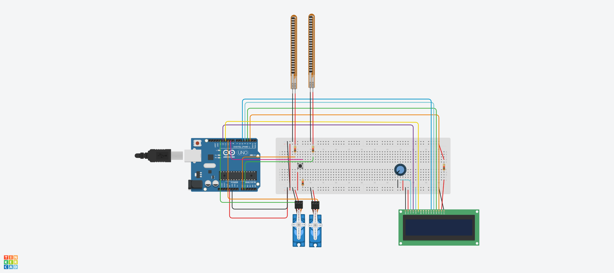
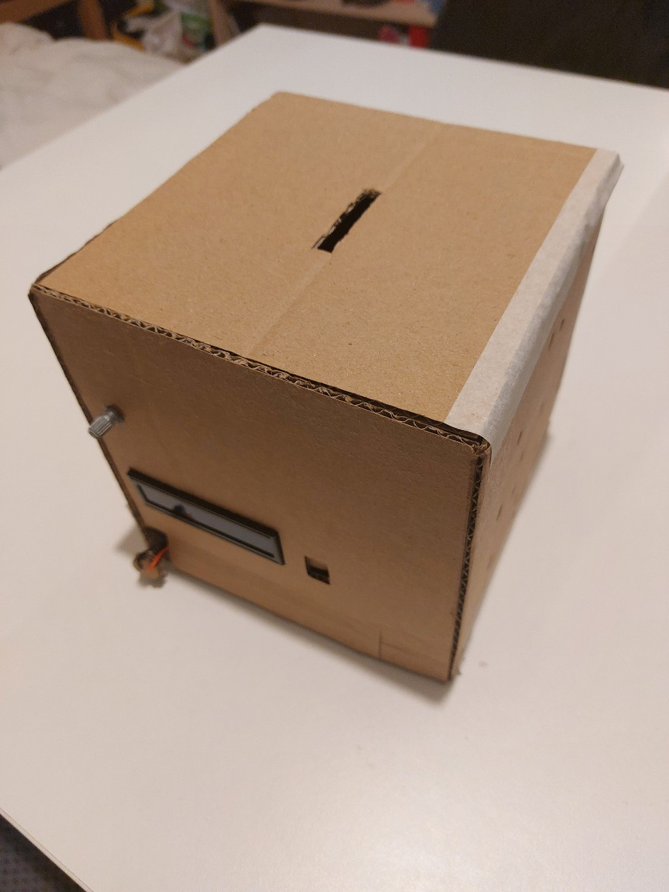

# Shocking Money Bank!

My project is making a money bank that gives an electric shock to its users when they try to take out money if the target amount is not reached.

## Result

* This is the circuit diagram of the final project.

* Click the below image to watch the play video of my final project!

## Links

* Final project code: (https://github.com/msc-creative-computing/p-comp-week-1-labs-YunJungJang0609/blob/main/Final_Project/Final_Project/Final_Project.ino)

* Week6 progress: (https://github.com/msc-creative-computing/p-comp-week-1-labs-YunJungJang0609/tree/main/Final_Project/Week6)

* Week7 progress: (https://github.com/msc-creative-computing/p-comp-week-1-labs-YunJungJang0609/tree/main/Final_Project/Week7)

* Week8 progress: (https://github.com/msc-creative-computing/p-comp-week-1-labs-YunJungJang0609/tree/main/Final_Project/Week8)

* Week9 progress: (https://github.com/msc-creative-computing/p-comp-week-1-labs-YunJungJang0609/tree/main/Final_Project/Week9)

