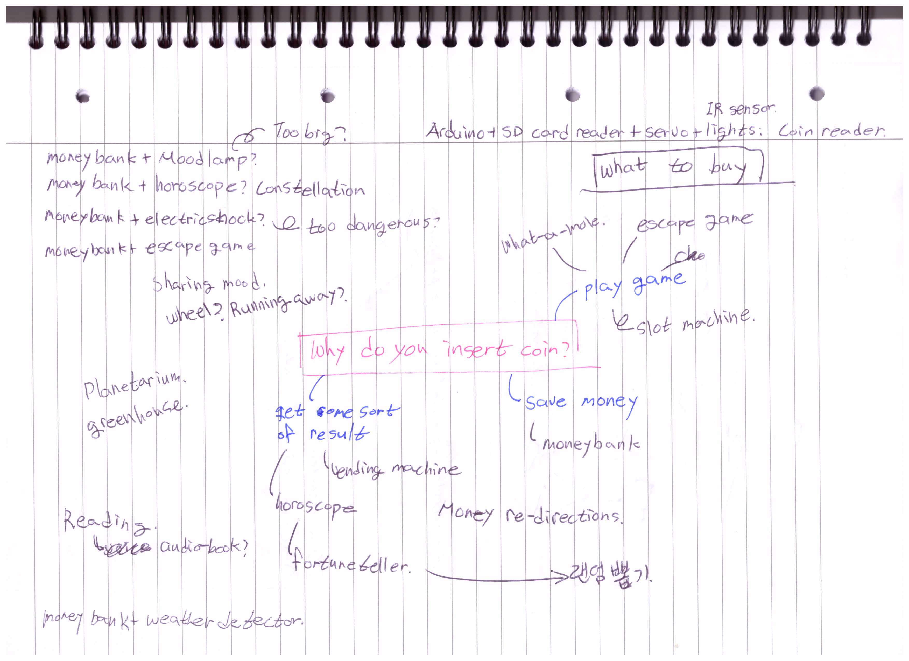
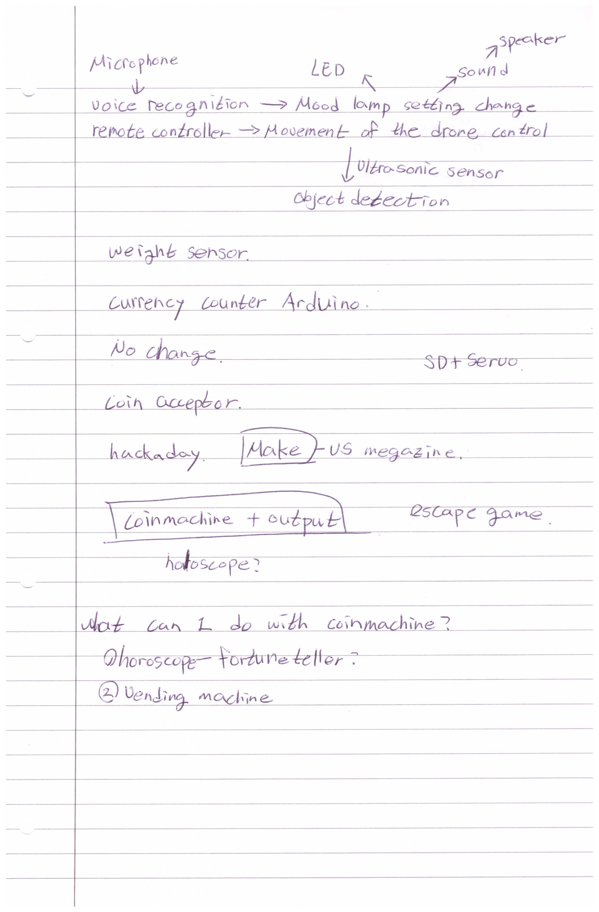
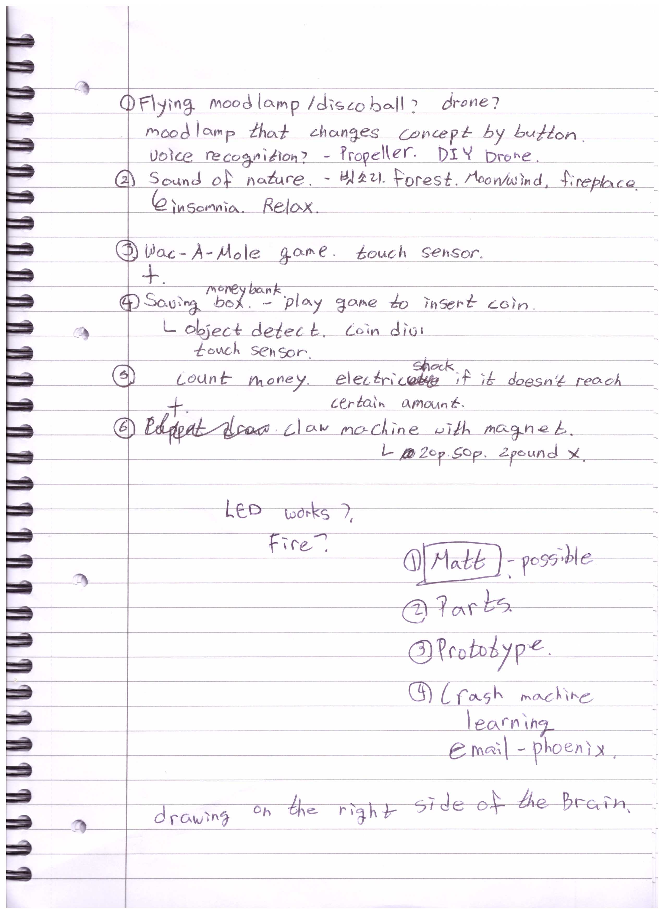
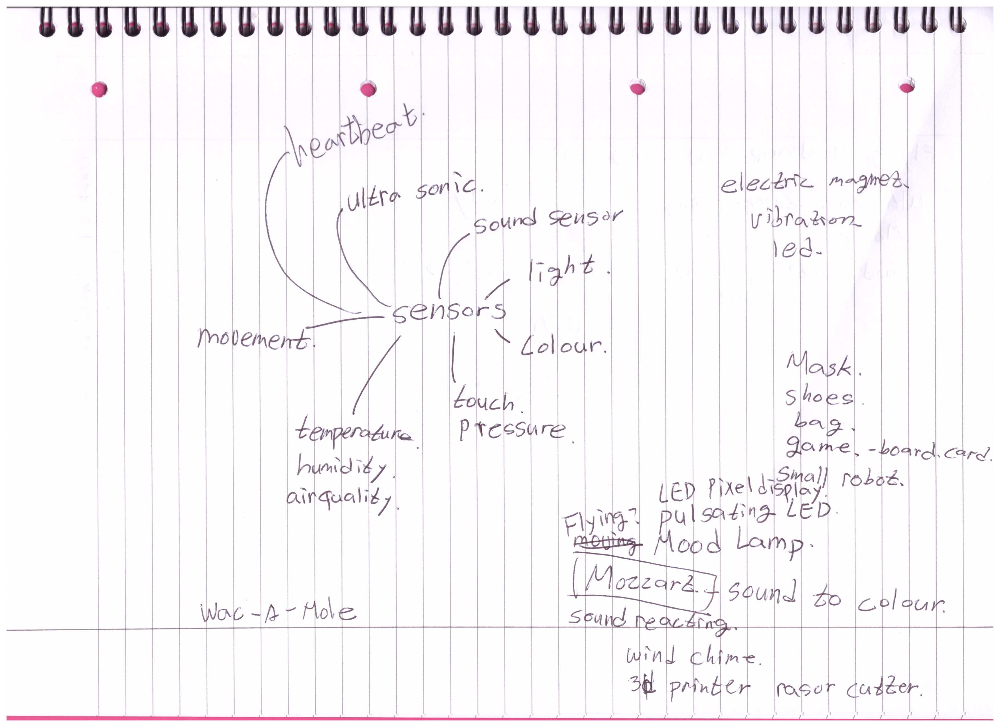
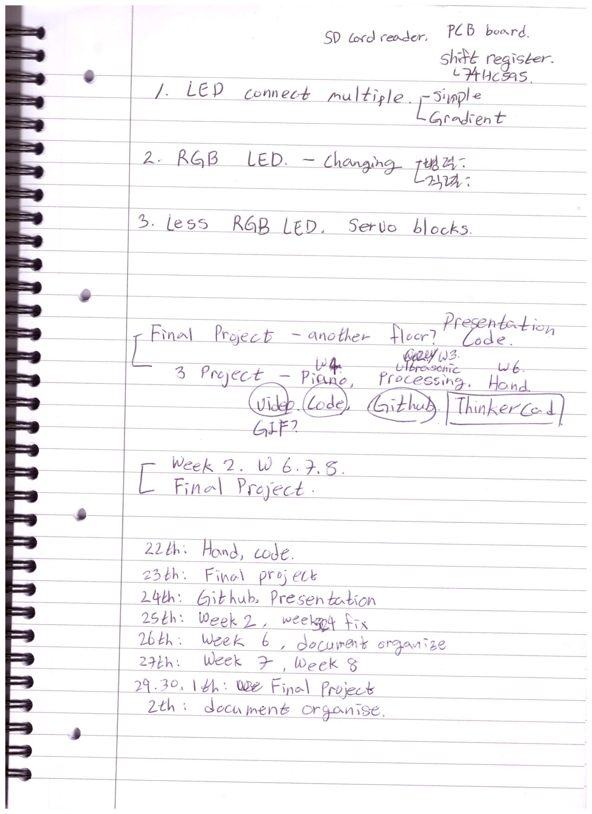
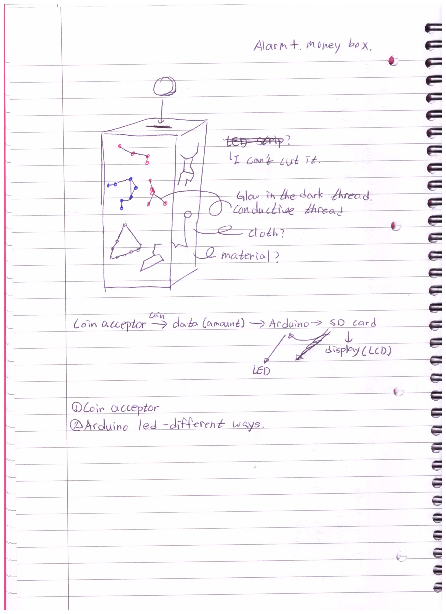

# Week 6

## Preparing presentation

I prepared a presentation about creating a wearable device that can detect the environment and health of elders for their safety. This has been rejected as it was too simple to make.

Initial plan was using a coin acceptor.

