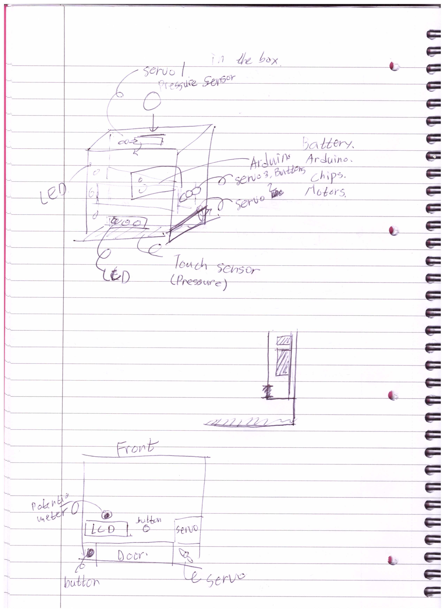
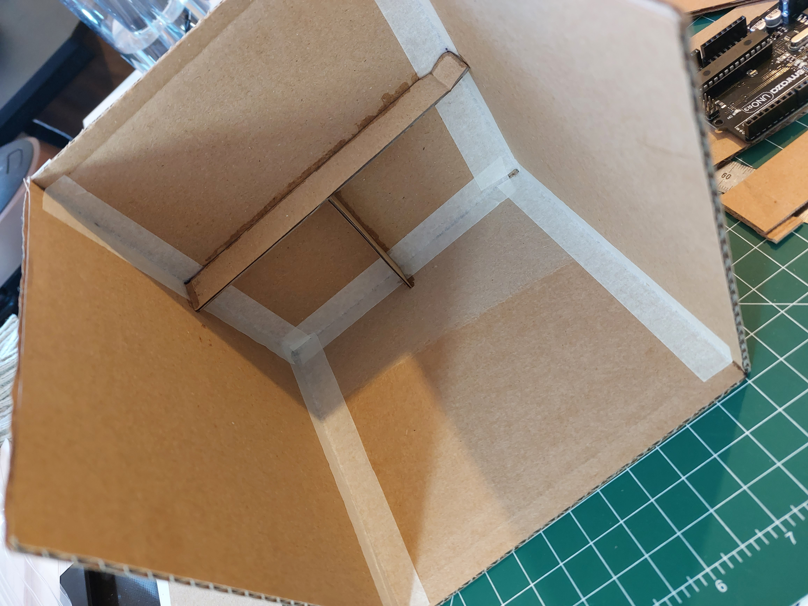

# Week 7

## Advanced Plan

Above image is the advanced plan of the money bank.

The drawing on the top is a perspective view which contains entire input and output plan. The second drawing is planning a space to put Arduino and battery to keep them away from the touch sensor. There will be a gap for electric wires to pass through.

 * The third drawing has been added on Week 8. This is explained in Week8 folder.

## Materials that I used

I used a box, electric lighter, servo motor, button, resistor, potentiometer, LCD, electric wire, velostat and PCB board.

## Generating an electric shock

I couldn't find a way to generate an electric shock to surprise people using 9V battery. I heard that tongue is the most conductive part among our body, so I tried both positive and negative side of the 9V battery on my tongue. I felt it! Thus, I was trying to make my body conductive, for example, using salty water. It was a nice try but it didn't work. 

After some attempt, I decided to use an electric shocker, which is a part of the electric lighter.
Check the next image:

The part that is marked with red line is the electric shocker that we will use. I connected an electric wire to the steel part of its bottom, and another wire to extend the purple wire.

Can you see the electric spark from the above image?

## Development progress of the week

I made a structure with a space to keep my arduino using a box.

