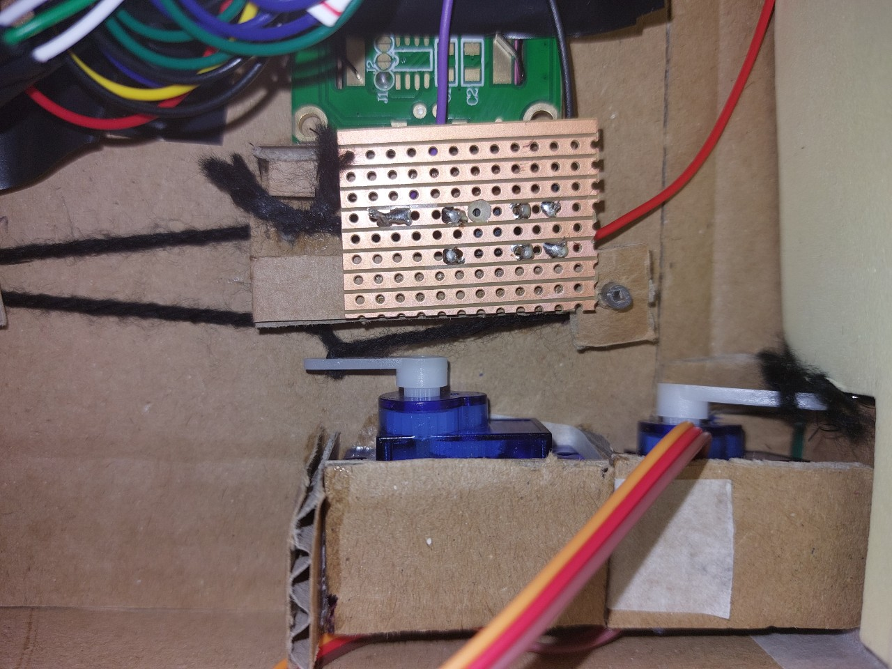

# Week 8

## Development progress of the week

### Servo1, This is a servo to open the door to take out money.

When the servo motor rotates, it pushes the door to open.

### Servo2, This is a servo that reveals a hidden button.

### LED strip

I made LED strip to work.

### Combining everything in the breadboard

At the first time, LCD screen says to users to press the button underneath to open the money bank. That button is a fake one that gives an electric shock. When the pressure sensor detects pressure (coin weight), servo for the button rotates to open the door to show a hidden button (Servo2, check the image above). When the user presses the button, another servo motor rotates to take out the coins from the money bank. It opens for the certain amount of time then closes the door.

Check the full video here: (https://youtu.be/WPOSl1WY1HE)