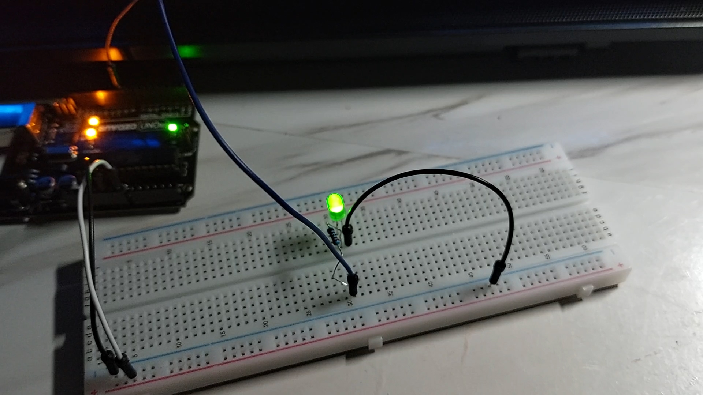
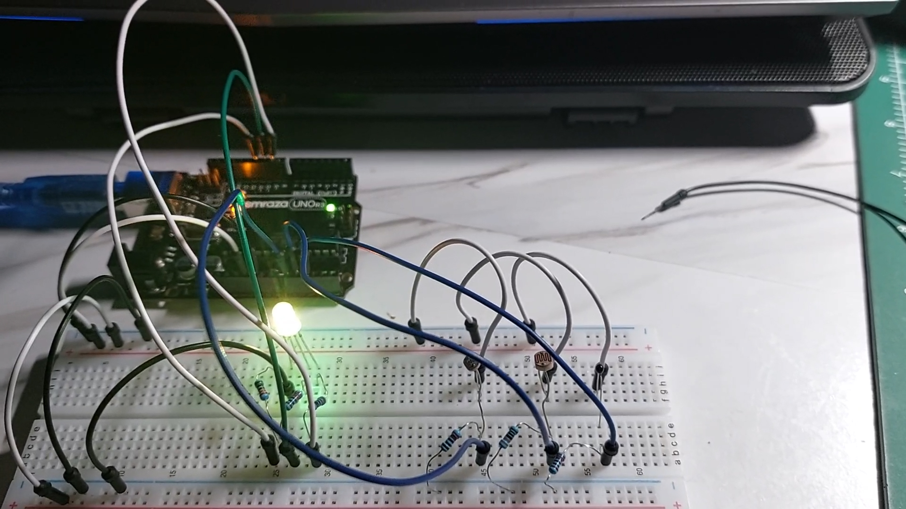
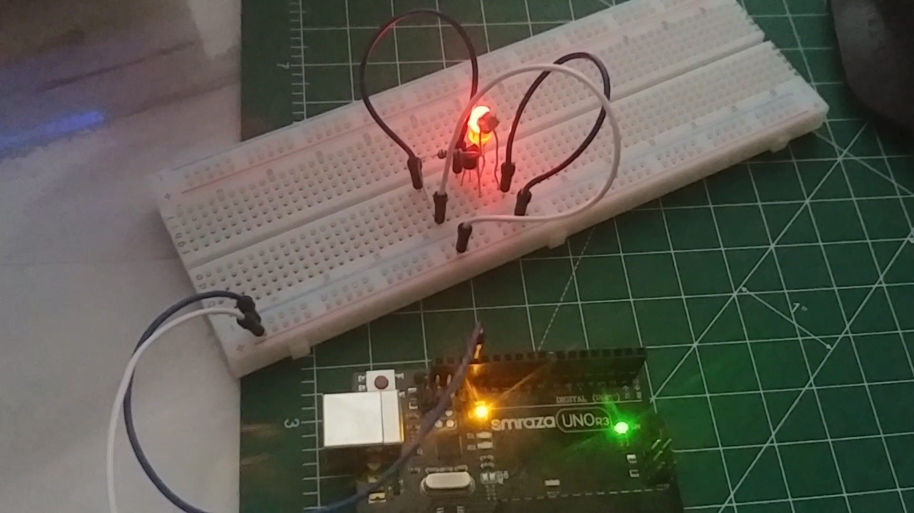
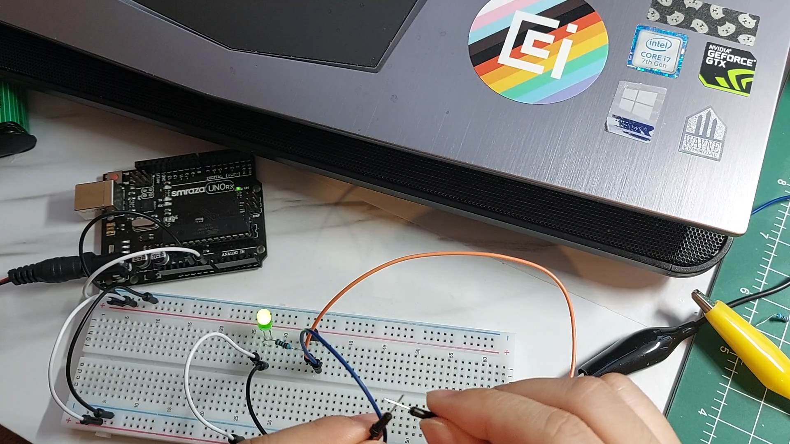
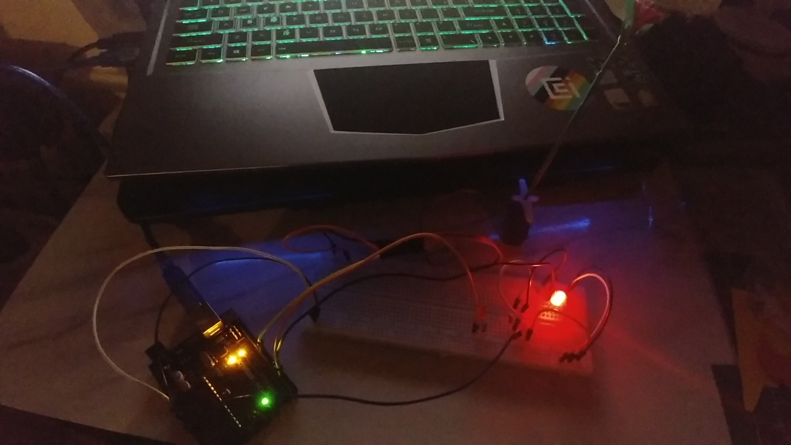
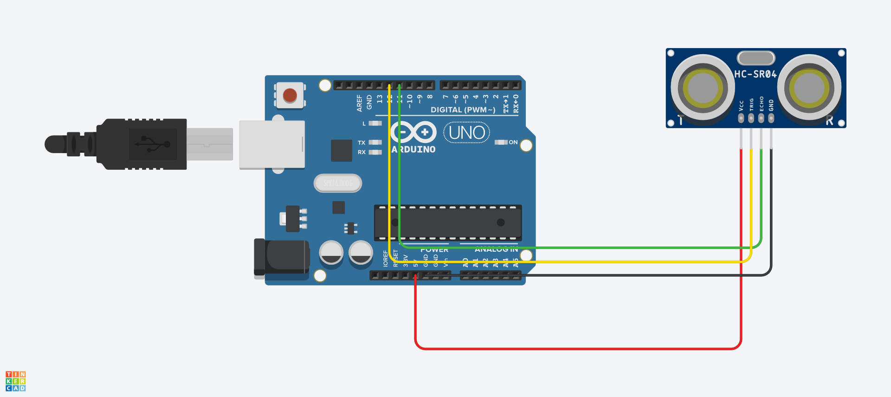
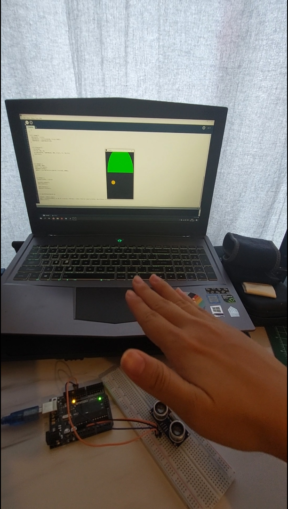

# Week 3

## Lab00 Soldering

{:width="50%"}

We learned how to solder parts to a circuit. I made 2 different push buttons.

## Lab01 PWM

LED fading in!

## Lab02 Voltage Dividers

I used 2 LDR and 1 temperature sensor to generate different lights with RGB LED!

## Lab03 Dark detecting Circuit for your pumpkins 

I made the dark-detecting LED.
Base code from: (https://makezine.com/projects/dark-detecting-led/)

## Lab03b Touch Sensor 

I made 2 different touch sensors using NPN transistor.

This uses a button:

## Lab04 Feedback systems

2 photoresistors sense 2 LEDs that light up at the different times. The light value from the different photoresistors activates a servo motor to rotate a flower. It looks like the flower always faces towards the light!

Base code is from here:
(https://create.arduino.cc/projecthub/Mako_/arduino-sunflower-c4fd84)

This is my first work:

## Moon game

This is an additional creative project that I made with using an ultrasonic sensor.
I connected the Arduino with the Processing graphics.
Make a moon to avoid high mountains!

I used a simple and default ultrasonic sensor circuit:

This is a play video of the moon escaping game:

