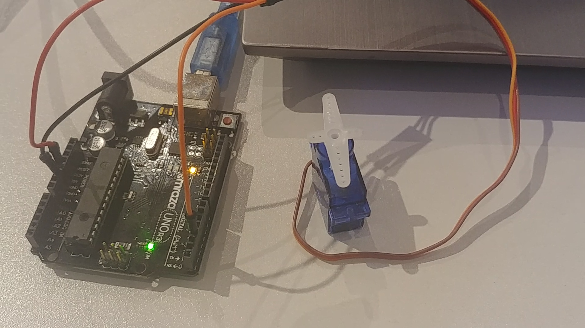

# Week 4

## Lab00 Working or not?

I tried to create a motor using battery, magnet and copper wire.
As I didn't have a big magnet, I tried to create a electric magnet using copper wire and small knife.
I guess I need more powerful battery to make it spin.

## Lab02 Hook up a servo

Hook up a servo and make it move using pwm.

## Lab03 Hook up a motor 

Using the circuit from the Arduino project book, do project 9.

## Lab04 Hook up an MPR121 

Create a circuit you control with a touch sensor.
Do this tutorial (https://learn.adafruit.com/adafruit-mpr121-12-key-capacitive-touch-sensor-breakout-tutorial/overview)

## Lab05 The Capsense library 

Base code from: (https://playground.arduino.cc/Main/CapacitiveSensor/)

I made a simple piano with Arduino!

]
