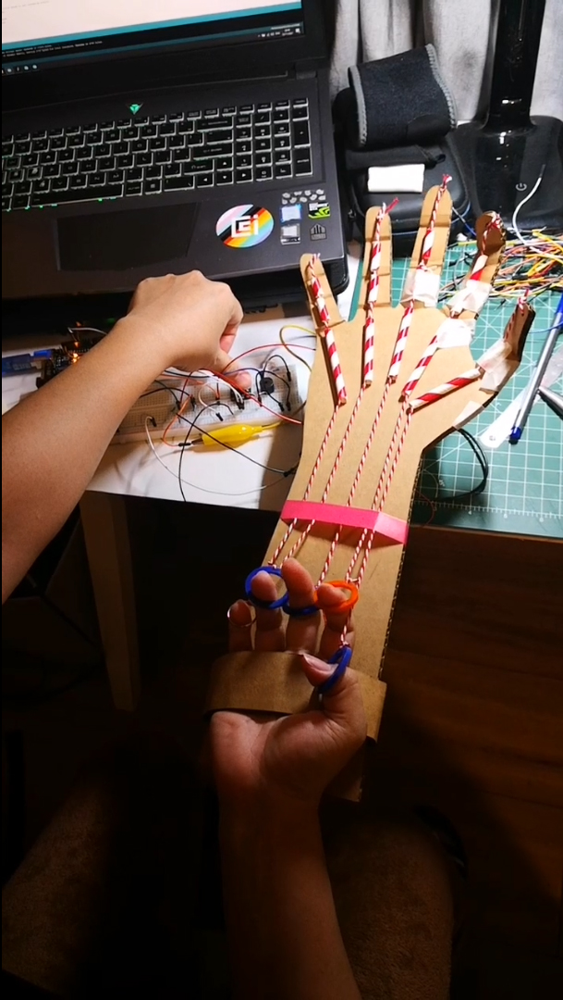

# Week 6

## Making the puppet hand 

### This is my circuit

### How does it move:

Combining with sounds. Fingers control the frequency and the tone of the sound:

### Click the image to watch the video

